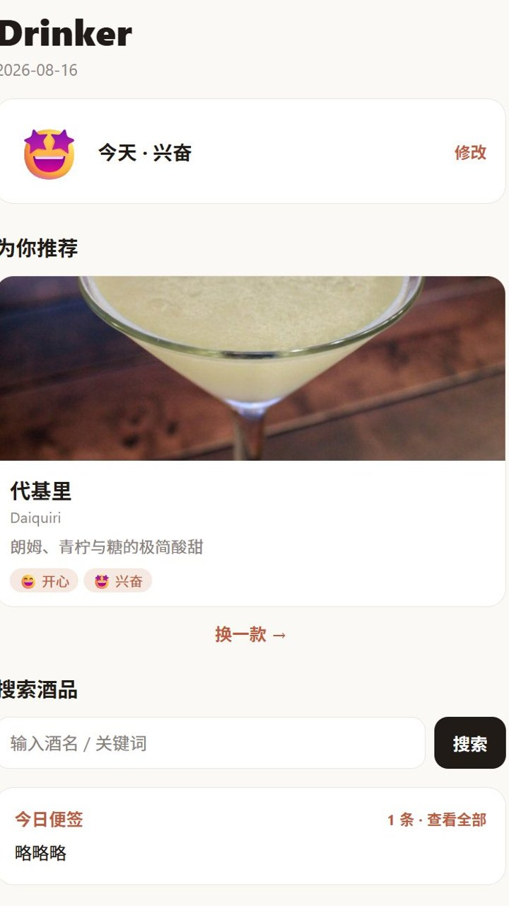
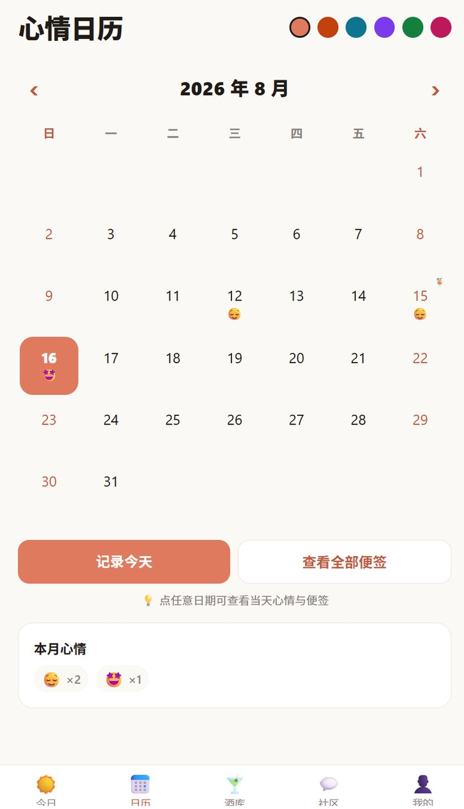
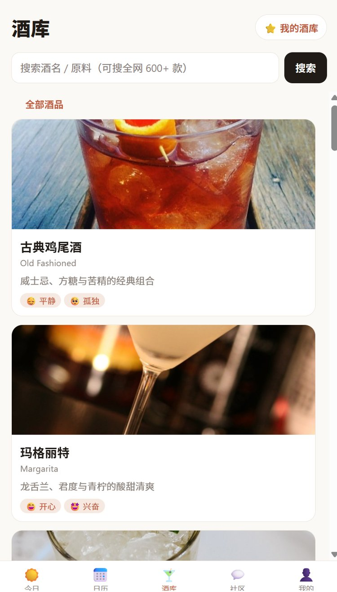
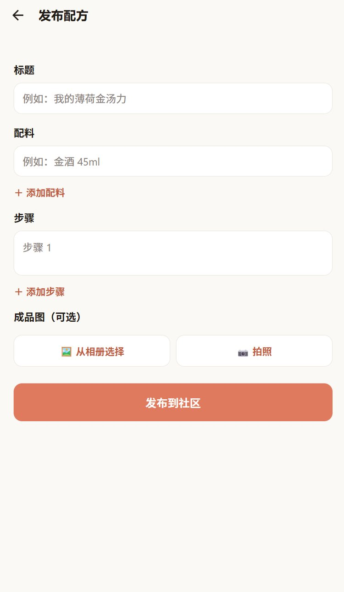
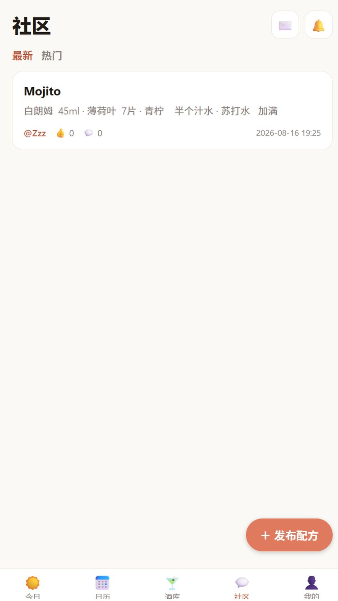
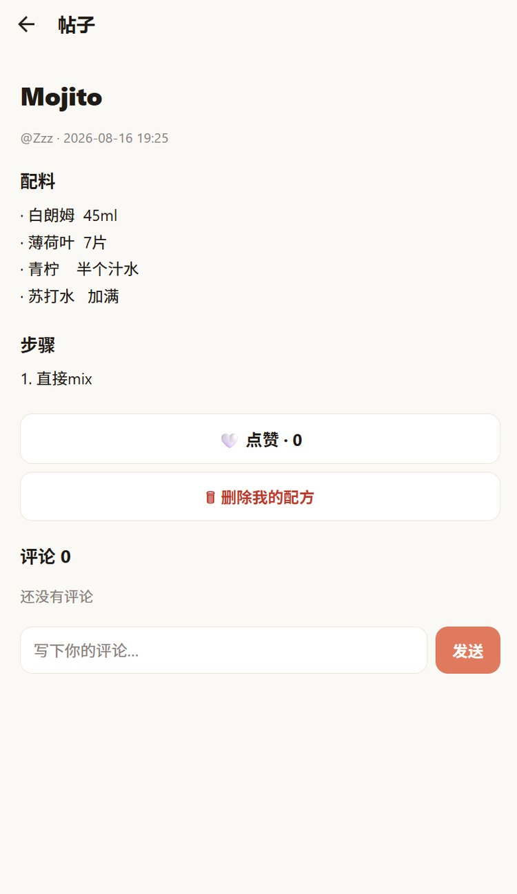

# Drinker 🍹

一款记录每日心情、按心情推荐酒品、并分享自制调酒配方的移动 App，同时支持 Android 与 Web。
心情用 emoji + 文字表达并同步到日历，每天根据你的心情，精选一款适合当下的酒，酒品详情包含中文历史渊源、
配方、做法和视频教程。

## 📸 项目截图

| 今日推荐 | 心情日历 |
| :---: | :---: |
|  |  |

| 酒库 | 发布配方 |
| :---: | :---: |
|  |  |

| 社区 | 帖子详情 |
| :---: | :---: |
|  |  |

## ✨ 功能

- **每日心情打卡**：每天第一次打开会询问并记录心情，支持 8 种 emoji 心情（开心/兴奋/平静/难过/焦虑/疲惫/孤独/生气），也可以跳过不填。
- **心情日历**：每日心情同步到月历，日历单元格严格对齐；点击任意日期弹出底部详情面板，可查看/修改当天心情、查看当天全部便签或新增便签，也可一键进入全部便签页。
- **每日多条便签**：同一天可添加任意多条便签，支持新建、编辑、删除；编辑时输入停止约 600ms 自动保存，离开编辑页也会提交最新草稿，无需重启 App。
- **全部便签页**：按日期分组、卡片式展示（带彩色标记条），右下角悬浮「＋」快速新建；长按任意便签可删除。
- **今日便签**：首页展示当天便签数量与最新一条，可直接进入全部便签或新建；所有文本输入框支持 Unicode 与 emoji。
- **每日酒品推荐**：每天根据你的心情，精选一款适合当下的酒，附历史渊源、配方、做法和视频链接，也可手动「换一款」。
- **中英文酒库搜索**：支持按酒名、原料和关键词搜索内置酒库及 TheCocktailDB 网络酒库（600+ 款）。网络酒品显示中文名称、分类、酒精属性，并在详情页提供中文历史、配料和步骤。
- **个人调酒配方**：个人酒库集中展示收藏酒品与自己发布的调酒配方，个人页可直接进入。
- **社区**：发布调酒配方，浏览、点赞和评论他人的配方，支持「最新 / 热门」排序；配方作者可在详情页删除自己的配方；成品图可从相册选择或使用相机拍摄。
- **头像设置**：用户可从相册选择头像或使用相机拍摄并上传。
- **用户互动**：支持访问用户主页、关注/取消关注、查看粉丝与配方数量，并显示实时在线状态。
- **实时私信**：用户之间可以发送私信，前台通过 WebSocket 实时到达，包含会话列表、未读数量与已读状态。
- **通知中心**：关注、私信、点赞和评论会生成站内通知；Android/iOS 正式构建可通过 Expo Push 接收后台系统通知。
- **云端图片**：头像和社区配方图片会在后端压缩后直接保存到 Turso，不依赖服务器本地磁盘或额外对象存储。
- **账号体系**：支持注册、登录和退出，心情、便签、收藏与社区内容按用户隔离。

## 🛠 技术栈

| 部分 | 技术 |
|------|------|
| 移动端与 Web | React Native + Expo（SDK 57）+ TypeScript + React Navigation |
| 后端 | Node.js + Express + libSQL/Turso（无云配置时回退到本地 SQLite）|
| 实时通信 | WebSocket（`ws`）+ Expo Push Notifications |
| 认证 | 密码 scrypt 散列 + 随机 token（存库，可撤销）|
| 数据 | 本地开发使用 SQLite；生产环境可使用 Turso/libSQL，酒品数据从 `server/data/drinks.json` 自动入库 |

## 📁 目录结构

```
drinker/
├── render.yaml      # Render Blueprint（后端服务 + Web 静态站点）
├── server/          # 后端 API
│   ├── src/
│   │   ├── index.js     # 全部路由（认证/心情/便签/酒品/社区）
│   │   ├── db.js        # SQLite/Turso 建表 + 酒品 seed + 旧便签迁移
│   │   ├── auth.js      # 密码散列 + token 中间件
│   │   ├── crypto.js    # 内容 AES 传输混淆（密钥可用 DRINKER_SECRET 覆盖）
│   │   └── moods-meta.js
│   ├── data/
│   │   └── drinks.json  # 酒品数据库（源数据）
│   └── package.json
└── mobile/          # Expo React Native App
    ├── App.tsx         # 导航 + 认证 Provider
    └── src/
        ├── screens/    # 今日/日历/全部便签/便签编辑/酒库/社区/我的 + 详情/发布页
        ├── components/ # MoodPicker / DrinkCard / PostCard / DayDetail / DayEditor
        ├── api.ts      # 后端客户端（自动探测后端地址）
        ├── AuthContext.tsx
        └── RealtimeContext.tsx  # WebSocket 在线状态与实时事件
        └── ...
```

## 🚀 快速开始（本地开发）

### 1. 启动后端

```bash
cd server
npm install
npm start        # 默认 http://localhost:4000
```

首次启动会自动创建 SQLite 数据库并把 `server/data/drinks.json` 入库。
验证：浏览器打开 <http://localhost:4000> 应返回 `{"ok":true,...}`。

后端支持 Turso 云数据库。在 `server/.env` 配置以下变量后，启动时会自动连接云端；未配置则继续使用本地 SQLite：

```env
TURSO_DATABASE_URL=libsql://your-database.turso.io
TURSO_AUTH_TOKEN=your-database-token
```

首次切换到 Turso 时，可运行一次迁移命令。它会复制本地数据并逐表核对数量，不会删除本地数据库：

```bash
cd server
npm run migrate:cloud
```

云端媒体、关注、私信和通知表会在后端启动时自动创建。可用下面的命令执行双用户端到端测试，测试数据会自动清理：

```bash
cd server
npm run test:social
```

WebSocket 地址与 API 共用域名，例如 API 为 `https://your-api.example.com` 时，客户端会自动连接 `wss://your-api.example.com/ws`。

### 2. 启动移动端

```bash
cd mobile
npm install
npx expo start
```

- **手机真机**：手机装 [Expo Go](https://expo.dev/go)，和电脑连**同一个 WiFi**，扫终端里的二维码即可。
- **浏览器预览**：按 `w`（或 `npm run web`）在浏览器里打开。

也可以直接启动 Web 预览：

```bash
cd mobile
npm run web
```

App 会自动把后端地址解析为 `http://<运行 Expo 的电脑 IP>:4000`（通过 Expo 开发服务器的 hostUri）。
如果你的后端部署在别处，可在 `mobile/app.json` 里加：

```json
"extra": { "apiUrl": "https://your-api.example.com" }
```

网络酒品详情的中文整理使用可选的通义千问兼容接口。未配置时仍会显示中文名称和基础中文说明；需要完整中文历史、配料和步骤时，在 `server/.env` 中配置：

```env
DASHSCOPE_API_KEY=your_api_key
TRANSLATE_MODEL=qwen-plus
```

## 🌐 生产部署（Render + EAS）

项目根目录的 `render.yaml` 是 Render Blueprint，可在 [Render](https://render.com) 一键部署：

- **后端 Web 服务**：`rootDir: server`，Build `npm ci`，Start `npm start`；需在 Environment 里填 `TURSO_DATABASE_URL` / `TURSO_AUTH_TOKEN` / `DASHSCOPE_API_KEY`。
- **Web 静态站点**：`rootDir: mobile`，Build `npm ci && npx expo export --platform web`，Publish Directory `dist`；建议加一条 Rewrite `/* → /index.html`（SPA 刷新防 404）。

Android 安装包用 EAS 构建：

```bash
cd mobile
npx eas-cli login
npx eas-cli build -p android --profile preview   # 产出 APK
```

Web 版对 iOS / 鸿蒙 NEXT 等无法安装 APK 的设备同样可用，直接通过浏览器访问即可（与 App 共用同一后端与数据）。

## 📱 Android 权限

- `INTERNET` / `ACCESS_NETWORK_STATE`：连接后端、搜索网络酒库和加载图片。
- `CAMERA`：拍摄社区配方成品图或头像，仅在用户主动选择拍摄时申请。
- `READ_MEDIA_IMAGES` / `READ_EXTERNAL_STORAGE`：从相册选择配方图片或头像，兼容不同 Android 版本。
- 本地开发后端默认使用 HTTP，Android 构建已启用 `usesCleartextTraffic`；正式公网部署建议改用 HTTPS。

## 🔐 隐私与安全

- **不收集敏感个人信息**：注册仅需「用户名 + 密码」，不收集手机号、身份证等实名信息；密码 scrypt 加盐散列存储，登录 token 为随机值存库、可撤销。
- **内容传输**：社区帖子/评论内容在客户端做 AES 混淆后上传、服务端解密入库（共享密钥可用环境变量 `DRINKER_SECRET` 覆盖）。真正的传输安全依赖 HTTPS；生产部署务必启用 TLS。
- **数据存储**：本地开发数据存于后端 SQLite；配置 Turso 后，用户、社区、消息、通知及媒体数据存于你自己的 Turso 云数据库，不经过第三方业务平台。
- **无多余组件**：不含内容审核、后台管理、广告/统计 SDK。
- **网络健壮性**：App 请求带 15 秒超时 + 自动重试（网络错误重试 2 次）。
- **生产建议**：`.env`、数据库与 SSH 私钥均已被 `.gitignore` 忽略，不会随仓库公开；部署到公网时启用 HTTPS（TLS），并关闭 `usesCleartextTraffic`。

## 📄 许可证

MIT
